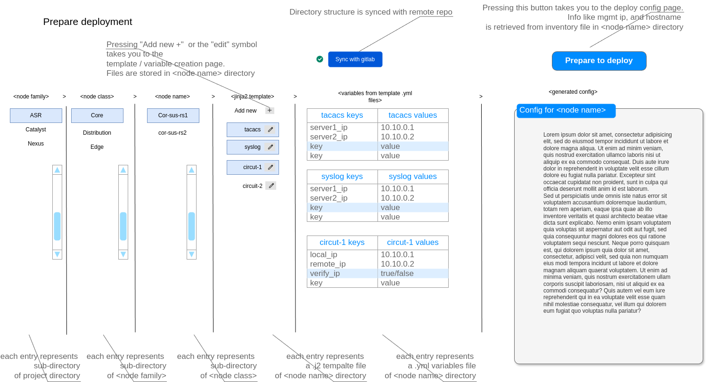
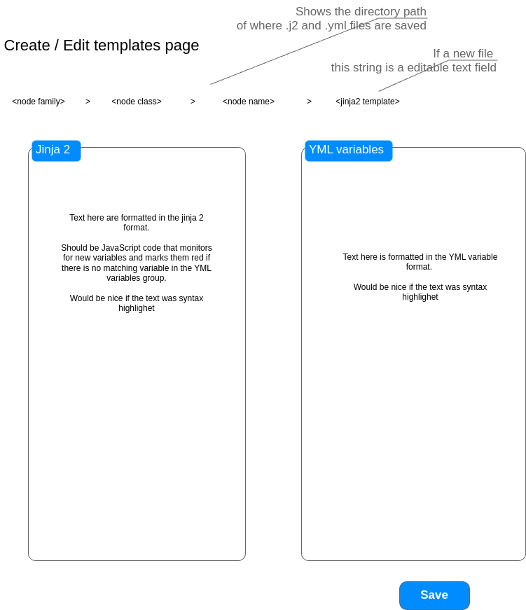
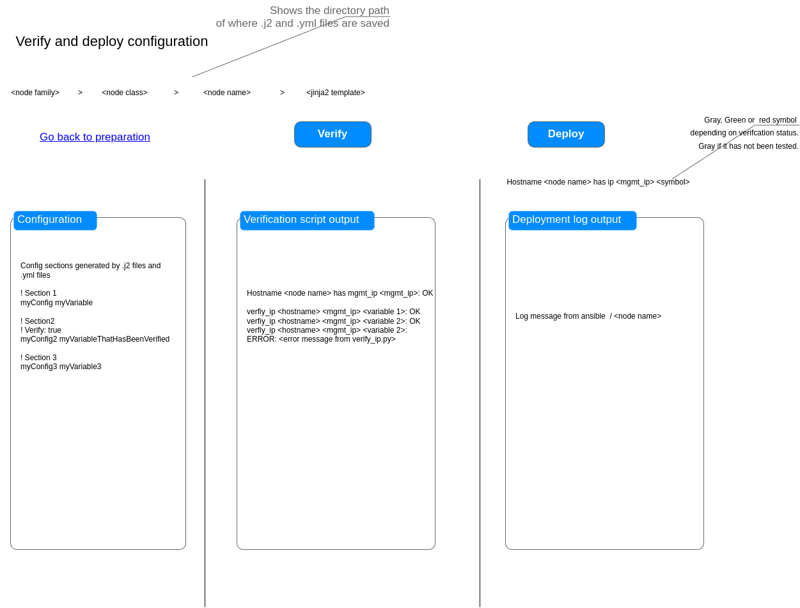

# ConfigHub Project Description

## Project Overview
For this web-app project I would like to use Python3, Flask, Jinja as templating language. The webapp is run only on Linux.

Goal of this web-app is to manage be a configuration management and deployment tool for network devices. The web-app should read a pre-defined directory structure: `<node family>` -> `<node class>` -> `<node name>`. Inside `<node name>` there would be an additional file structure detailed below. `<node family>` is placed in the `<root folder>` folder.

The project should be a frontend to a file structure that can be used in cli to manually generate config from Ansible playbooks that is stored in the subfolder of `<node name>`.

This folder structure is meant to store and manage jinja2 templates, yml files, inventory files, and ansible playbooks for configurations for network equipment.

## Authentication and Logging
The web-app must support login with a user database. Each action of the user should be logged. If the user does an action that commits to the git repo, the user credentials should be used. The user login system must be prepared to use AD LDAP in the future. So the web app must have a configuration file were one can select if one is to use local user db, or AD LDAP.

## Description of "Prepare Configuration" Page
The work-flow of the web-app is that first we are presented with the "Prepare configuration page" - At its very first display there would be nothing displayed except for the title of the page and "Sync with gitlab" button. Pressing this button would at first run clone the specified remote git repository down to the `<root folder>`. This root folder should be at a separate location than the web-app. e.g. /opt/NetworkConfigGenerator. This location should be specified in a .env file in the web-app folder.

The link to the remote git repo is also specified in the .env file together with the token needed to access the repo.

After the repo is cloned. If the "sync with gitlab" button is pressed again, any changes to the repo should be added and committed, then the repo should be pulled, and then pushed. If any errors, a link should be displayed under the button, to a page were the error can be displayed in full.

When the filestructure is synced, the web-app should read the structure and be prepared to display it as the user selects the different items on the different levels.

If I select an item on the "`<node family>`" level, the other levels should show the first item at each level. If the user then selects a different item on the next level "`<node class>`", then "`<node names>`" for that "`<node class>`" directory should be displayed. Again the first of "`<node names>`" should be selected by default.

The `<template name>.yml` files of "`<node name>`"/vars should be shown in the "`<jinja template>`" column in the "Prepare configuration page". There should always be a corresponding `<template name>.j2` template file in `<root folder>/template/<node family>/<node class>/`. If this file lacks the web-app should display a warning for each file missing.

The web app should remember the users selection if the user switches to a different view. The user can only select one item in the columns "`<node family>`, `<node class>`, `<node name>`". But the user can select one or more items in the "`<jinja template>`" column. If so, the web app should display the .yml files in the column of "variables for template .ymls" for each of the selected items in the column `<jinja templates>`. The content of `<jinja templates>` is populated from the filenames in the `<node name>/vars/*.yml`, if there is a corresponding .j2 file in the template folder of `<root folder>/template/<node family>/<node class>/`. Again, if this is not so, the web app should display a warning for each missing template.

If the user wants to edit the data of the variable, the user can click the data part of the variable, and be able to type in a new string in the data variable field. The .yml file on disk should then be updated. From this view the user may not edit the variable name. Only the data. The configuration should be updated live when the user selects or edit any times. The configuration should be stored in the `<node name>/preview/` folder. The configuration header should display the date time it was generated in a human readable format. It should read from a file in `<node family>` which style of commenting it should use.

When the user is happy with selected templates, and their corresponding .yml files, that now contains the right data. The user can press the "Prepare to deploy" button. The user will then be taken to the "Prepare to deploy" page.

## Description of "Prepare to Deploy" Page
This page has three functions, sectioned into three parts:

1. First part is to display the generated config. This config is loaded from the `<node name>/preview` folder.
2. Second part is to run the verification scripts and display status message, and any error message.
3. Third part is to run ansible which is used as our deployment engine, and to display status messages from it, and the network equipment. When deployment is run, logging as defined in section "Directory structure of `<node name>`" should be done.

Would be preferable if the status text in the output part from ansible is updated live for the user after the deploy button is pressed.

## Description of "Manage Templates and Variables" Page
If the "Add new" or the "edit symbol" in the template name item is pressed in the `<jinja template>` column in the "Prepare configuration page", the user is directed to the "Manage templates and variables page" were the user can edit the .j2 template file, and the .yml file.

If the user selected "Add new" in the previous page, the `<jinja2 template>` string is made into a text field which is selected, ready for the user to type in a filename. The user must just type in the first part of the name. not the suffix. If the user do write in a suffix. eg. .j2 or .yml, or any other .XXX. This is removed. So the web-app verifies that the file is stored with the correct filename of `<template name>.j2` and `<template name>.yml`

So when the user press' the button "save", the user should be asked if he/she really wants to make this change. If so, the `<template name>.j2` is saved to `<root folder>/template/<node family>/<node class>/`, and the `<template name>.yml` is saved to the folder `<node name>/vars`.

The gitlab status symbol on the "Prepare configuration page" should be changed to a yellow ! - Indicating that there is unsynced content in the file structure.

## Directory Structure of `<node name>`

```
inventory/
    inventory file in the Ansible file format.
vars/
    all of the variable files in .yml format
preview/
    The generated configuration file. Used same filename. Should only contain one file at all times.
logs/
    deployment_date_time/
        Deployment logs.
        Config backup of <node name> before change.
        Deployment config.
verification/
    verification python scripts that take in <hostname> <mgmt_ip> <variable to verify>
    <filename same as verification variable name in yml file>
    e.g. if variable name is verify_ip, the python script is named verify_ip.py
    Generated Ansible playbook file.
```

## Directory Structure of the `<root folder>/template`
The template folder is placed at `<root folder>/template/<node family>/<node class>/` - e.g. so the templates are grouped in `<node family>` and `<node class>`

`<node family>` is the model family of the equipment, like ASR, or Catalyst, or Nexus, and the `<node class>`, is the three layer network architecture of "Core", "Distribution", or "Edge". To both of `<node family>`, or `<node class>` there could be additional folders.

This template folder mirror the `<node name>` folder structure. `<node name>` is to refer to the `<root folder>/template` structure for its templates since this is common for the `<node family>`/`<node class>/` grouping.

## Page Layouts

### Prepare Configuration Page


**Key Features:**
- Directory structure is synced with remote repo
- Four-column layout showing node family, node class, node name, and jinja templates
- Each entry represents a sub-directory or file
- Templates from node name/vars directory shown with corresponding .j2 files
- Variables for templates displayed with editable values
- Generated config preview shown on right side
- "Prepare to deploy" button takes user to deploy config page
- "Add new" or edit symbol takes user to template/variable creation page

### Manage Templates and Variables Page


**Key Features:**
- Shows directory path of where .j2 and .yml files are saved
- Two-panel layout for editing Jinja2 templates and YML variables
- Text fields with syntax highlighting
- For new files, template name becomes an editable text field
- JavaScript code monitors for variables missing in YML file
- Save button commits changes to filesystem

### Prepare to Deploy Page


**Key Features:**
- Shows directory path
- Three-panel layout: Configuration, Verification output, Deployment log
- Configuration panel shows content generated by templates and variables
- Verify button runs verification scripts
- Deploy button runs Ansible for configuration deployment
- Gray/Green/Red symbol indicates verification status
- "Go back to preparation" link returns to config page
- Live status updates from Ansible shown in deployment log panel